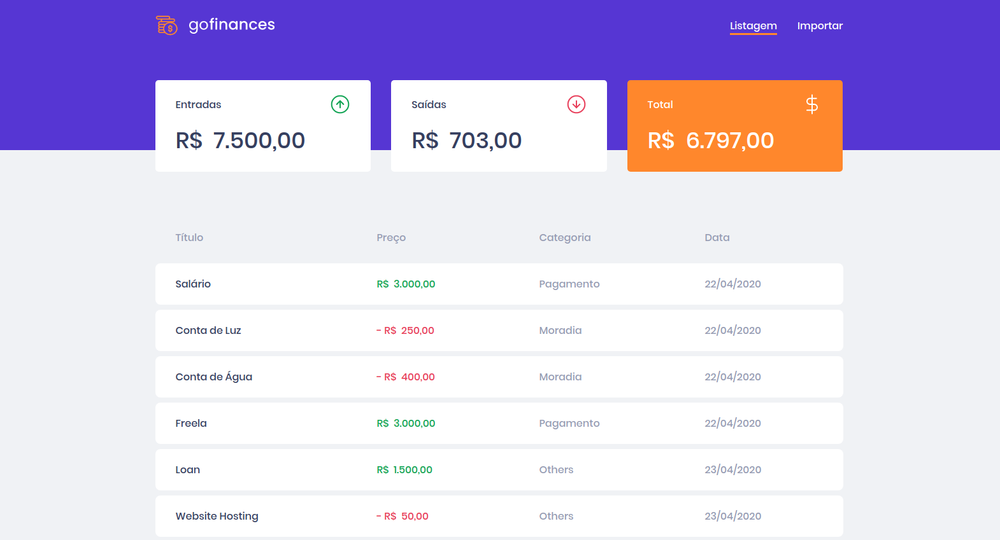

<h1 align="center">
  
</h1>

<p align="center">
  
  
  
  
  
</p>

<p align="center">
  <a href="#information_source-how-to-use">ℹ️ How To Use</a>&nbsp;&nbsp;&nbsp;|&nbsp;&nbsp;&nbsp;
  <a href="#rocket-technologies">🚀 Technologies</a>&nbsp;&nbsp;&nbsp;|&nbsp;&nbsp;&nbsp;
  <a href="#computer-author">💻 Author</a>&nbsp;&nbsp;&nbsp;|&nbsp;&nbsp;&nbsp;
  <a href="#memo-license">📝 License</a>
</p>

<p align="center">
  GoFinances is a simple financial control project developed in ReactJS during Rocketseat's GoStack 11.
</p>

---



# :information_source: How To Use

Clone the repository

```bash
https://github.com/tavareshenrique/go-finances-web.git
```

```bash
# Install the dependencies
yarn
# or
npm install

# Run the GoFinances Back-End before running the GoFinances Web project
https://github.com/tavareshenrique/go-finances-api

# Run GoFinances Web
yarn start
# or
npm start
```

# :rocket: Technologies

- [ReactJS](https://pt-br.reactjs.org/)
- [TypeScript](https://www.typescriptlang.org/)
- [Axios](https://github.com/axios/axios)
- [date-fns](https://date-fns.org/)
- [History](https://www.npmjs.com/package/history)
- [Polished](https://github.com/styled-components/polished)
- [React Router DOM](https://reacttraining.com/react-router/web)
- [Styled Components](https://www.styled-components.com/)
- [ESLint](https://eslint.org/)
- [Prettier](https://prettier.io/)
- [React App Rewired](https://github.com/timarney/react-app-rewired)

# :computer: Author

<table>
  <tr>
    <td align="center">
      <a href="http://github.com/tavareshenrique/">
        
        <br />
        <sub>
          <b>Henrique Tavares</b>
        </sub>
       </a>
       <br />
       <a href="https://www.linkedin.com/in/tavareshenrique/" title="Linkedin">@tavareshenrique</a>
       <br />
       <a href="https://github.com/tavareshenrique/
                feet-app/commits?author=tavareshenrique" title="Code">💻</a>
    </td>
    <td align="center">
      <a href="https://github.com/Rocketseat/">
        
        <br />
        <sub>
          <b>Rocketseat</b>
        </sub>
       </a>
       <br />
       <a href="https://www.linkedin.com/in/tavareshenrique/" title="Linkedin">@Rocketseat</a>
       <br />
       <a href="https://github.com/tavareshenrique/go-marketplace/commits?author=tavareshenrique" title="Code">💻</a>
    </td>
  </tr>
</table>

# :memo: License

This project is licensed under the MIT license - see the archive [LICENSE.md](https://github.com/tavareshenrique/go-finances-web/blob/master/LICENSE.md) for details.
